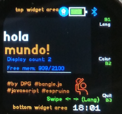
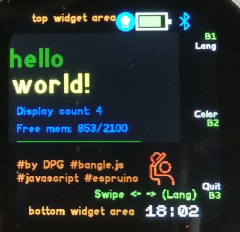

# hello, world!

A cross cultural hello world!/hola mundo! app
The most common testing sentence in several languages ;)

## Pictures:

Launcher icon

Screen - Spanish

Screen - English

Screen - Japanese

## Usage

Open and see a hello, World! in the screen 
interact to change language, color or quit.

## Features

Colours, all inputs , graph, widgets loaded 
Counter for Times Display

## Controls

finger swipe 
button 1 (2 and 3 for Bangle.JS1)
touch screen left, center or right

## Creator

This app is so basic that probably the easiest is to just edit the code 
Otherwise you can contact me [here](https://github.com/dapgo/my_espruino_smartwatch_things)